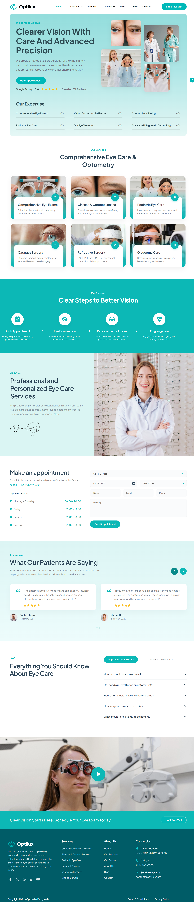
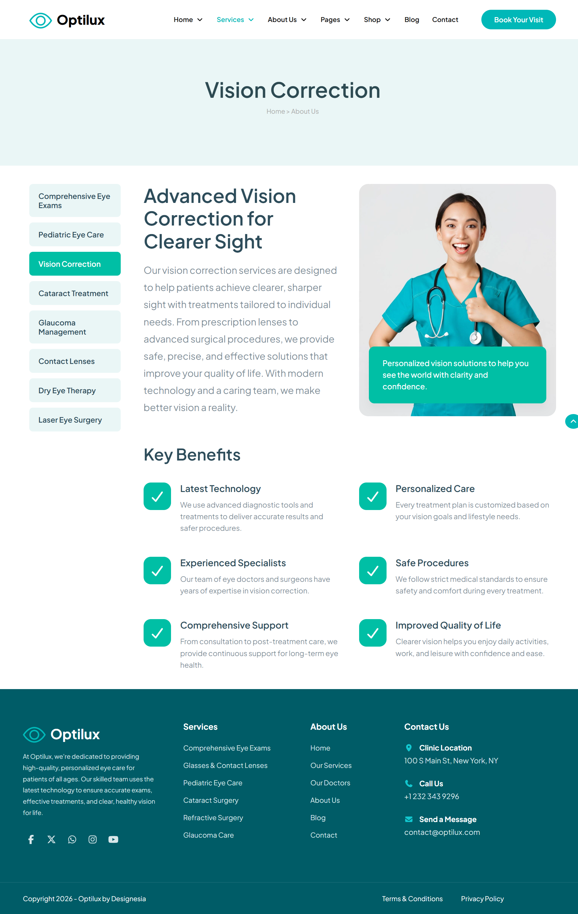
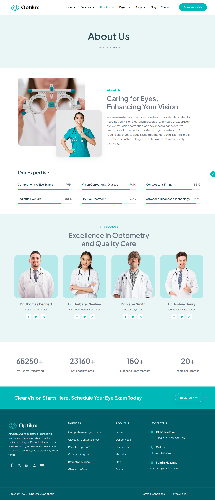
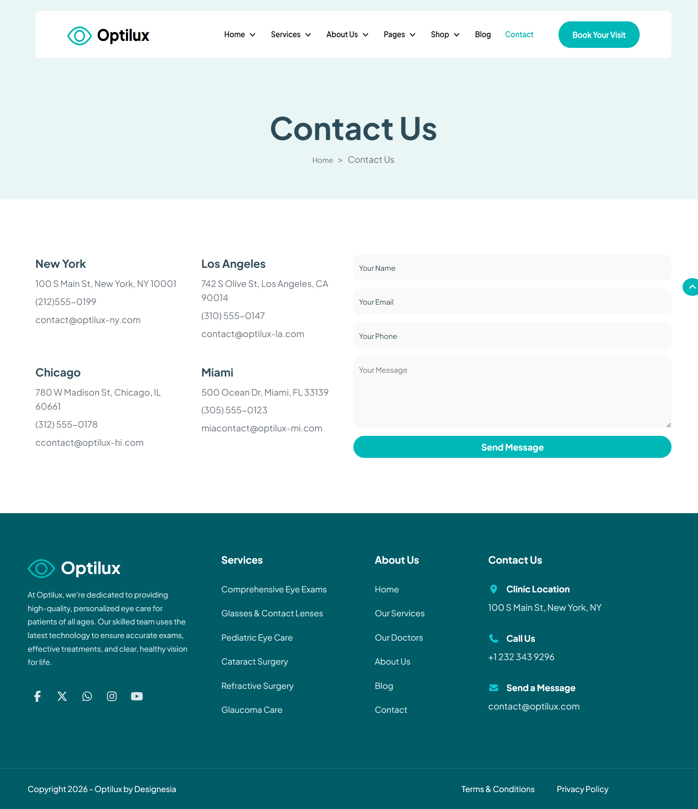
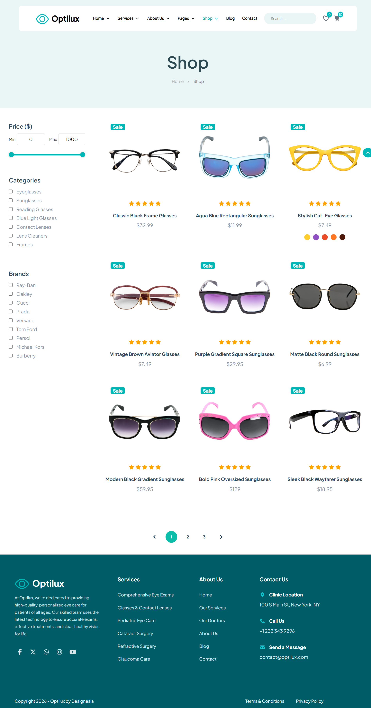
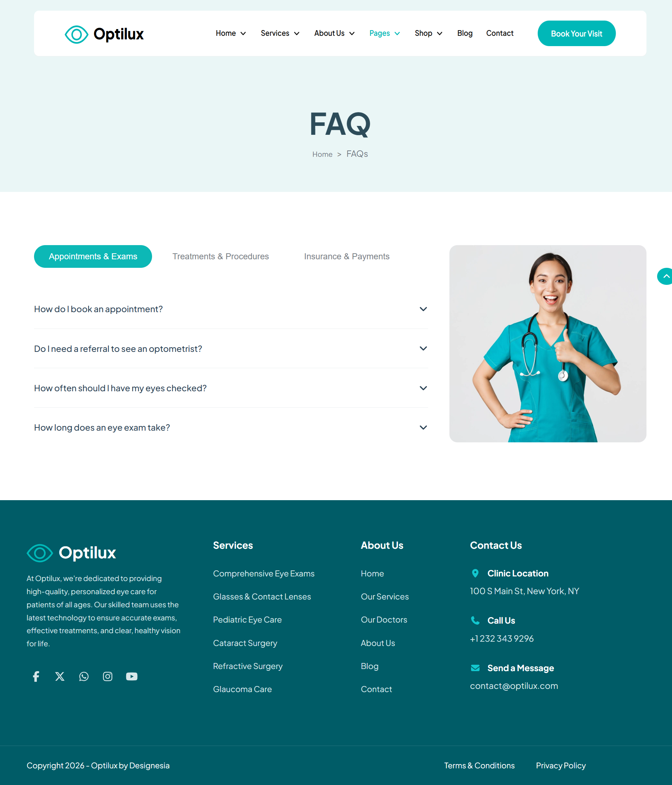

# 👁️ Optilux - Eye Care Landing Page

## 📌 Overview

**Optilux** is a modern and fully responsive Eye Care & Optometry landing page developed using **HTML5** and **CSS3**.

This project was created by **Ahmed El Makrini** as the final HTML & CSS project at **MolenGeek Coding School**. The goal was to build a complete multi-page website while applying modern web design principles, responsive layouts, and clean code architecture.

---

## 🚀 Features

- Modern UI/UX Design
- Fully Responsive Layout
- Multi-Page Website
- Clean HTML5 Structure
- Pure CSS3 Styling
- Smooth Hover Effects
- Service Showcase Section
- Appointment Booking Form
- Testimonials Section
- FAQ Section
- Contact Page
- Shop Pages
- About Us Page

---

## 📂 Pages Included

| Page | Description |
|--------|------------|
| Home | Main landing page |
| Services | Eye care services showcase |
| About | Information about the clinic |
| Contact | Contact information and form |
| Shop | Product listing page |
| Shop 2 | Additional shop layout |
| Testimonials | Customer reviews |
| FAQ | Frequently asked questions |

---

## 🛠️ Technologies Used

- HTML5
- CSS3
- Flexbox
- CSS Grid
- Responsive Design
- Google Fonts

---

## 📸 Screenshots

### Home Page

---

### Services Page

---

### About Page

---

### Contact Page

---

### Shop Page

---

### FAQ Page

---

## 🎯 What I Learned

During this project I practiced:

- Responsive Web Design
- CSS Flexbox & Grid
- Component-Based Layouts
- Form Styling
- Website Structure Organization
- Modern UI Design Principles
- Clean and Maintainable Code

---

## 👨‍💻 Author

### Ahmed El Makrini

Front-End Developer passionate about creating modern and responsive web experiences.

**GitHub:** https://github.com/ahmed200-em

---

## 📄 License

This project is for educational and portfolio purposes.

---

⭐ If you like this project, feel free to star the repository.